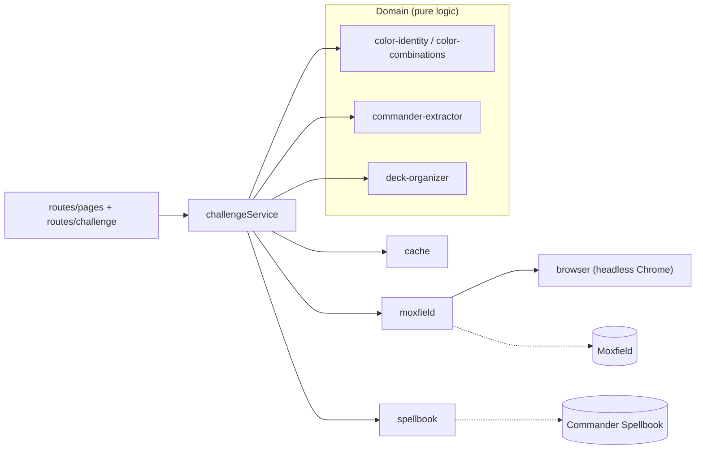
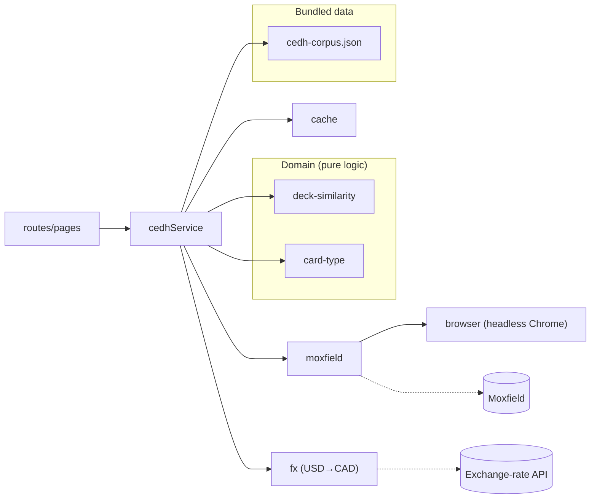
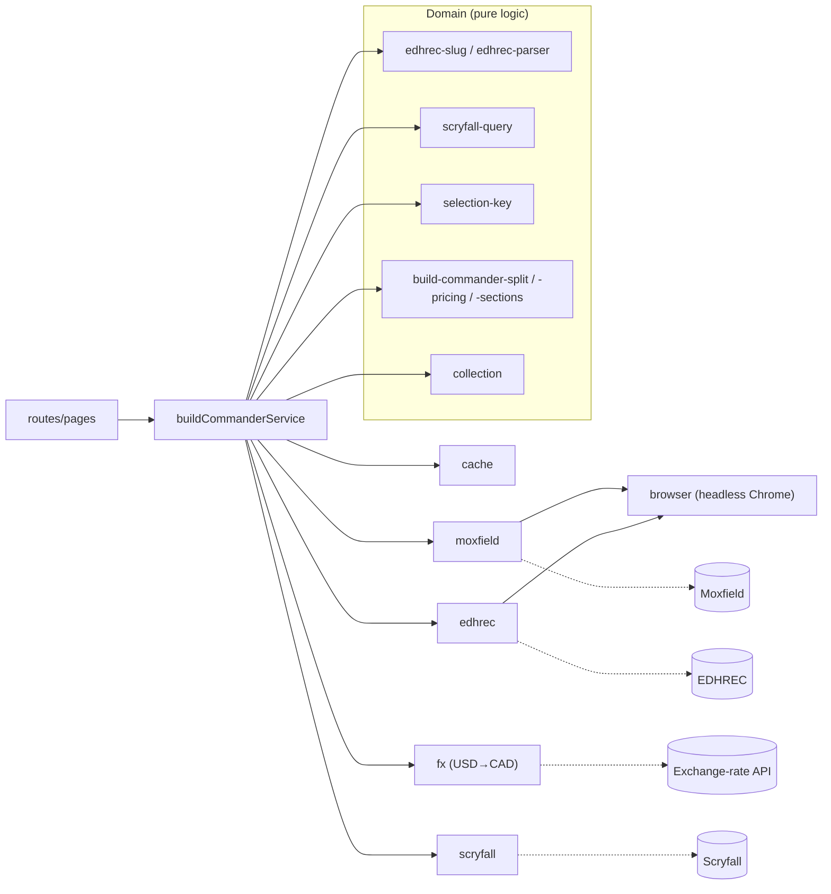

# 🃏 Necro Nerds — EDH Deck Tools

A full-stack [Hono](https://hono.dev) application that serves both a server-side rendered web UI and a JSON REST API for a set of Magic: The Gathering Commander (EDH) deck tools. Enter a Moxfield username (or pick a commander) and get:

- **📊 32 Deck Challenge** — see which of the 32 color-identity slots you've filled with Commander decks, plus infinite combos in each deck via Commander Spellbook.
- **⚔️ Build a cEDH Deck** — match your card pool against a corpus of competitive (cEDH) decks and find the ones you're closest to being able to build, with a CAD-priced buy list.
- **🛠️ Build a Commander** — pick any commander (plus optional partner and companion) and see which of EDHREC's recommended cards you already own versus what you'd need to buy.

No auth. No database. No sign-up. Just enter a username and go.

> The older standalone CLI tool that this project started as has been relocated to [`utils/`](./utils). See `utils/README.md` for how to run it.

---

## Tech Stack

| Layer | Technology | Purpose |
|-------|-----------|---------|
| **Web Framework** | [Hono](https://hono.dev) v4 | HTTP routing, middleware, JSX SSR |
| **Runtime** | Node.js 22+ | ES modules, native fetch |
| **Rendering** | Hono JSX | Server-side rendered HTML (no React, no client JS bundle) |
| **Browser Automation** | [Puppeteer](https://pptr.dev) v25 | Headless Chrome for Cloudflare bypass (Moxfield + EDHREC) |
| **Combo Detection** | [Commander Spellbook API](https://commanderspellbook.com) | Find EDH combos in decks |
| **Card Data** | [Scryfall API](https://scryfall.com/docs/api) | Commander/companion autocomplete + card pricing |
| **Recommendations** | [EDHREC](https://edhrec.com) | Recommended cards for a commander |
| **Cache (Production)** | [Upstash Redis](https://upstash.com) | HTTP-based serverless Redis |
| **Cache (Local)** | [ioredis](https://github.com/redis/ioredis) v5 | Standard Redis via TCP (Docker) |
| **Cache (Fallback)** | In-memory Map | Zero-config development fallback |
| **Language** | TypeScript 5.8 | Strict mode, ES2022 target |
| **Bundler** | tsc | Direct TypeScript compilation |
| **Dev Server** | [tsx](https://github.com/privatenumber/tsx) | Hot-reload during development |
| **Deployment** | Docker | Multi-stage Dockerfile for containerized runs |

---

## Feature Architecture

Necro Nerds is built from three features that share a common set of services. Each service is either **I/O + orchestration** (`src/services/`) or **pure business logic** (`src/domain/`). The diagrams below show, per feature, which services back it and how they connect.

Two services are shared connective tissue across every feature:

- **`cache`** — multi-driver cache (Upstash / ioredis / in-memory). Every orchestrating service reads/writes through it.
- **`moxfield`** — Puppeteer-backed Moxfield scraper. It sits behind the shared **`browser`** service (a single headless Chrome instance).

### 📊 32 Deck Challenge

Fetches a user's Commander decks, maps each to one of the 32 color-identity slots, and decorates each deck with infinite combos from Commander Spellbook.



**Services:** `challengeService` ← `cache`, `moxfield` (← `browser`), `spellbook`
**Domain:** `color-combinations`, `color-identity`, `commander-extractor`, `deck-organizer`

### ⚔️ Build a cEDH Deck

Takes the union of every card across a user's Commander decks as their "collection," then scores it against a bundled corpus of competitive decks to find the closest matches, each with a CAD-priced missing-cards buy list.



**Services:** `cedhService` ← `cache`, `moxfield` (← `browser`), `fx`
**Domain:** `deck-similarity`, `card-type`
**Data:** `cedh-corpus.json` (bundled cEDH reference corpus)

### 🛠️ Build a Commander

Given a commander selection (commander + optional partner/companion), pulls EDHREC's recommendations, cross-references them against the user's collection, splits owned vs. missing, and prices the buy list in CAD.



**Services:** `buildCommanderService` ← `cache`, `moxfield` (← `browser`), `edhrec` (← `browser`), `fx`, `scryfall`
**Domain:** `edhrec-slug`, `edhrec-parser`, `scryfall-query`, `selection-key`, `build-commander-split`, `build-commander-pricing`, `build-commander-sections`, `collection`

> **Autocomplete:** The commander/companion type-ahead routes (`/api/scryfall/commanders`, `/api/scryfall/companions`) use `scryfallService` directly — they don't go through `buildCommanderService`.

---

## Project Structure

```
/ (repo root)
├── src/                            # THE WEB APPLICATION (Hono SSR + API)
│   ├── index.ts                    # Server entry point, service wiring, route mounting
│   ├── config.ts                   # Environment variable loading + cache driver detection
│   ├── types.ts                    # All TypeScript interfaces
│   │
│   ├── domain/                     # Pure business logic (no I/O)
│   │   ├── color-combinations.ts   # 32 color slot definitions
│   │   ├── color-identity.ts       # WUBRG resolution + key conversion
│   │   ├── commander-extractor.ts  # Extract commanders from deck data
│   │   ├── deck-organizer.ts       # Map decks to 32 slots
│   │   ├── deck-similarity.ts      # cEDH matching (normalized card-name sets)
│   │   ├── card-type.ts            # Card-type classification
│   │   ├── collection.ts           # Build a user's owned-card collection
│   │   ├── selection-key.ts        # Stable cache key for a commander selection
│   │   ├── edhrec-slug.ts          # Commander name → EDHREC slug
│   │   ├── edhrec-parser.ts        # Parse EDHREC recommendation data
│   │   ├── scryfall-query.ts       # Build Scryfall search/pricing queries
│   │   ├── build-dispatch.ts       # Validate + build Build-a-Commander URLs
│   │   ├── build-commander-split.ts    # Owned vs. missing partition
│   │   ├── build-commander-pricing.ts  # USD→CAD pricing of buy lists
│   │   └── build-commander-sections.ts # Group results into display sections
│   │
│   ├── services/                   # I/O and orchestration
│   │   ├── cache.ts                # Multi-driver cache (Upstash / ioredis / memory)
│   │   ├── browser.ts              # Shared headless Chrome (Puppeteer) instance
│   │   ├── challenge.ts            # 32 Deck Challenge orchestrator
│   │   ├── cedh.ts                 # Build a cEDH Deck orchestrator
│   │   ├── build-commander.ts      # Build a Commander orchestrator
│   │   ├── fx.ts                   # USD→CAD exchange-rate service
│   │   ├── moxfield.ts             # Puppeteer-based Moxfield scraper
│   │   ├── edhrec.ts               # Puppeteer-based EDHREC client
│   │   ├── scryfall.ts             # Scryfall autocomplete + pricing client
│   │   └── spellbook.ts            # Commander Spellbook combo detection API client
│   │
│   ├── routes/                     # HTTP route handlers
│   │   ├── challenge.ts            # JSON API endpoints (/api/*)
│   │   ├── health.ts               # Health check endpoint
│   │   └── pages.tsx               # SSR page routes (all three features)
│   │
│   ├── views/                      # Hono JSX components (server-rendered)
│   │   ├── layout.tsx              # Base HTML shell + all CSS
│   │   ├── home.tsx                # Landing page with mode toggle + autocomplete
│   │   ├── challenge.tsx           # 32-slot progress grid (with combo badges)
│   │   ├── cedh-match.tsx          # cEDH match results
│   │   ├── build.tsx               # Build-a-Commander results
│   │   ├── deck-detail.tsx         # Single deck with card list + combos section
│   │   ├── board-badge.tsx         # Board/section badge component
│   │   ├── loading.tsx             # SSE loading page (per-mode phases)
│   │   └── error.tsx               # Error page component
│   │
│   ├── middleware/
│   │   └── error-handler.ts        # Maps domain errors to HTTP responses
│   │
│   ├── scripts/
│   │   └── build-cedh-corpus.ts    # Generates src/data/cedh-corpus.json
│   │
│   ├── data/
│   │   └── cedh-corpus.json        # Bundled cEDH reference corpus
│   │
│   └── public/
│       └── favicon.svg             # Skull favicon
│
├── utils/                          # The relocated standalone CLI tool (see utils/README.md)
├── dist/                           # Compiled output (git-ignored)
├── .env.example                    # Environment variable template
├── Dockerfile                      # Multi-stage production build
├── docker-compose.yml
├── render.yaml
├── package.json
├── package-lock.json
└── tsconfig.json
```

---

## Running with Docker

The easiest way to run the full app (API + Redis) locally is with Docker Compose.
Everything runs in containers — no local Node or Redis setup required.

```bash
# Build and start in the background
docker compose up -d --build

# View logs
docker compose logs -f

# Stop and remove the containers
docker compose down
```

Once running, open http://localhost:3000.

### Choosing the port

The host port is configurable via the `APP_PORT` environment variable. The
container always listens on 3000 internally; `APP_PORT` only changes which port
on your machine maps to it. It defaults to `3000` when unset.

```bash
# Run on a custom port — app available at http://localhost:8080
APP_PORT=8080 docker compose up -d --build
```

Or set it persistently by copying `.env.example` to `.env` (Docker Compose loads
`.env` from this directory automatically) and editing the value.

---

## Running Locally

### Prerequisites

- **Node.js 22+** — `node --version` (this repo pins the version in `.nvmrc`)
- **npm 7+** — `npm --version`
- **Chrome/Chromium** — Puppeteer downloads its own on `npm install`

### Quick Start

```bash
npm install
cp .env.example .env
npm run dev
```

Open `http://localhost:3000` in your browser.

### With Local Redis

```bash
# Start Redis container
docker run -d --name redis-local -p 6379:6379 redis:alpine

# Add to .env
REDIS_URL=redis://localhost:6379

# Start server
npm run dev
```

### Available Scripts

| Script | Command | Description |
|--------|---------|-------------|
| `npm run dev` | `tsx watch src/index.ts` | Dev server with hot reload |
| `npm run build` | `tsc && cp static assets` | Compile TS + copy `public`/`data` to `dist` |
| `npm run build:cedh` | `tsx src/scripts/build-cedh-corpus.ts` | Generate/refresh the cEDH corpus |
| `npm start` | `node dist/index.js` | Run compiled production build |
| `npm run typecheck` | `tsc --noEmit` | Type-check without emitting |
| `npm test` | `vitest run` | Run the test suite |

---

## Endpoints

### SSR Pages (HTML)

| Method | Path | Feature | Description |
|--------|------|---------|-------------|
| GET | `/` | — | Landing page with mode toggle (challenge / cedh / build) |
| GET | `/search?username=X&mode=challenge\|cedh\|build` | — | Dispatches to the correct loading page based on mode |
| GET | `/challenge/:username` | 32 Deck Challenge | 32-slot progress grid with commander art |
| GET | `/loading/:username` | 32 Deck Challenge | Loading page (SSE progress) |
| GET | `/cedh/:username` | Build a cEDH Deck | Top 5 closest competitive decks + buy lists |
| GET | `/cedh/loading/:username` | Build a cEDH Deck | Loading page (SSE progress) |
| GET | `/build/:username?commander=&partner=&companion=` | Build a Commander | Owned vs. missing recommendations + CAD buy list |
| GET | `/build/loading/:username?commander=…` | Build a Commander | Loading page (SSE progress) |
| GET | `/deck/:deckId` | — | Deck detail with cards grouped by type |
| POST | `/refresh/:username` | 32 Deck Challenge | Force refresh, redirects to challenge page |
| POST | `/cedh/refresh/:username` | Build a cEDH Deck | Force refresh of cEDH matches, redirects back |
| POST | `/build/refresh/:username?commander=…` | Build a Commander | Force refresh of build result, redirects back |
| GET | `/favicon.svg` | — | Skull favicon |

### JSON API

| Method | Path | Description |
|--------|------|-------------|
| GET | `/api/health` | Service health (cache + browser status) |
| GET | `/api/challenge/:username` | Full challenge progress as JSON |
| GET | `/api/decks/:username` | Flat list of all commander decks |
| GET | `/api/deck/:deckId` | Single deck detail with card groupings |
| POST | `/api/refresh/:username` | Force cache refresh, returns fresh data |
| GET | `/api/challenge/:username/progress` | SSE progress stream (32 Deck Challenge) |
| GET | `/api/cedh/:username/progress` | SSE progress stream (Build a cEDH Deck) |
| GET | `/api/build/:username/progress?commander=…` | SSE progress stream (Build a Commander) |
| GET | `/api/scryfall/commanders?q=…` | Commander type-ahead suggestions (Scryfall) |
| GET | `/api/scryfall/companions?q=…` | Companion type-ahead suggestions (Scryfall) |

---

## Build a cEDH Deck

The app can match a user's card pool against a corpus of known competitive
(cEDH) decks and show the ones they're closest to being able to build.

### How it works

1. **Reference corpus** — A build script pulls the
   [cEDH Decklist Database](https://cedh-decklist-database.com) (`database.json`),
   keeps the `COMPETITIVE` archetypes, extracts their Moxfield decklist links,
   and fetches each deck's full card list via the existing Moxfield service.
   The result is written to `src/data/cedh-corpus.json` and bundled into the build.
2. **User collection** — On request, the app fetches all of a user's legal
   commander decks and takes the union of every card across them as their
   "collection."
3. **Matching** — Each reference deck is scored by *owned fraction*: of the
   cards in that deck, how many does the user already own? Decks are ranked
   best-first and the top 5 are shown, each with a **missing-cards buy list**
   priced in CAD.

The similarity logic lives in `src/domain/deck-similarity.ts` (pure functions,
normalized card-name matching). At runtime the corpus can also be overridden via
a cache entry (`edh:cedh:corpus`) so it can be refreshed without a redeploy;
otherwise the bundled file is used.

### Generating / refreshing the corpus

```bash
# Generate the full corpus (launches Puppeteer, fetches ~110 decks)
npm run build:cedh

# Test with a small subset
npm run build:cedh -- --limit=5

# Include BREW-section decks as well as COMPETITIVE
npm run build:cedh -- --include-brew

# Write somewhere other than src/data/cedh-corpus.json
npm run build:cedh -- --out=/tmp/corpus.json
```

The generated `src/data/cedh-corpus.json` should be committed so it ships with
the build. Because the cEDH metagame shifts over time, re-run `build:cedh`
periodically to refresh it.

---

## Configuration

### Environment Variables

| Variable | Required | Default | Description |
|----------|----------|---------|-------------|
| `PORT` | No | `3000` | Server port |
| `NODE_ENV` | No | `development` | Environment (`development`, `production`) |
| `CACHE_DRIVER` | No | auto-detect | Cache backend: `upstash`, `redis`, or `memory` |
| `REDIS_URL` | No | `redis://localhost:6379` | Redis connection URL (ioredis TCP driver) |
| `UPSTASH_REDIS_REST_URL` | No | — | Upstash Redis REST URL |
| `UPSTASH_REDIS_REST_TOKEN` | No | — | Upstash Redis REST token |
| `CACHE_TTL_SECONDS` | No | `900` | Cache TTL in seconds (15 min default) |
| `MOXFIELD_BASE_URL` | No | `https://api2.moxfield.com/v2` | Moxfield API base URL |
| `PUPPETEER_TIMEOUT_MS` | No | `60000` | Puppeteer navigation timeout (ms) |
| `PUPPETEER_HEADLESS` | No | `true` | Set to `false` to see browser window |
| `APP_PORT` | No | `3000` | Host port that maps to the container (Docker Compose) |

### Cache Driver Auto-Detection

When `CACHE_DRIVER` is not explicitly set:

1. If `UPSTASH_REDIS_REST_URL` AND `UPSTASH_REDIS_REST_TOKEN` are set → **Upstash** (HTTP)
2. If `REDIS_URL` is set → **ioredis** (TCP)
3. Otherwise → **In-memory** (resets on restart)

---

## Design Decisions

| Decision | Rationale |
|----------|-----------|
| No auth or database | Users just type a username — zero friction |
| Hono JSX for SSR | No client-side JS bundle, fast page loads, single deploy unit |
| Puppeteer for Moxfield + EDHREC | Both are behind Cloudflare WAF, no official API key available |
| Commander Spellbook for combos | Free public REST API, no auth required, comprehensive combo database |
| Non-blocking combo detection | Spellbook failures gracefully degrade (empty combos) — never breaks page |
| Lazy browser init | Don't block startup; health checks stay fast on hosting platforms |
| Shared browser instance | One Chromium process for all requests; auto-reconnects if stale |
| Multi-cache driver | Works anywhere: free hosting (Upstash), local dev (Docker Redis), or zero-config (memory) |
| Domain logic is pure | `domain/` modules have no I/O — easily testable, backed by property-based tests |

---

## 🤖 AI Disclaimer

This project was built entirely with [Kiro](https://kiro.dev), an AI-powered development environment by Amazon, orchestrated through Kiro's spec-driven workflow (requirements → design → tasks → implementation) with property-based testing.

## License

ISC
